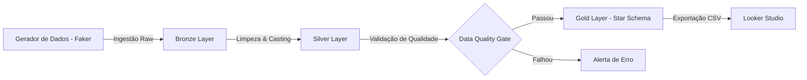

# 🛍️ Vendas - Mini Data Warehouse & Analytics

Este projeto é uma simulação **End-to-End** de Engenharia de Dados focada no varejo (Vendas Omnichannel).

O objetivo foi construir um pipeline de dados robusto que ingere dados transacionais, aplica regras de qualidade, modela para Business Intelligence e entrega um Dashboard executivo automatizado.


---

## 📊 Resultado Final (Dashboard)
O pipeline alimenta um Painel Gerencial no **Looker Studio**, permitindo análise de receita por canal, performance de produtos e geografia.


## 🏗️ Arquitetura da Solução

O projeto segue a **Medallion Architecture** (Bronze, Silver, Gold), processada localmente com DuckDB e orquestrada via Prefect.



## 🛠️ Tecnologias e Técnicas

| Categoria     | Tecnologia      | Detalhes da Implementação |
|---------------|-----------------|----------------------------|
| Linguagem     | Python 3.12     | Scripting e manipulação de arquivos |
| Banco de Dados| DuckDB          | Banco OLAP local para processamento SQL de alta performance |
| Orquestração  | Prefect         | Gerenciamento de fluxo e dependência de tarefas (Pipeline) |
| Modelagem     | Star Schema     | Tabelas Fato e Dimensões na camada Gold |
| Qualidade     | Pandas          | Framework próprio de validação (Null checks, regras de negócio) |
| Visualização  | Looker Studio   | Dashboard interativo com filtros dinâmicos |

---

## 📂 Estrutura do Data Lake

O projeto organiza os dados em camadas lógicas para garantir governança:

**◾ `data/bronze/`**  
Dados brutos (`vendas.csv`, `clientes.csv`) simulando o sistema de origem.

**◾ `data/silver/`**  
Dados tratados: correção de tipos (Data/Decimal), remoção de duplicatas e enriquecimento (joins).

**◾ `data/gold/`**  
Dados prontos para consumo.

**◾ `fato_vendas`**  
Tabela transacional otimizada.

**◾ `dim_cliente`**  
Dimensão com perfil e segmentação.

**◾ `dim_produto`**  
Dimensão com catálogo e categorias.

---

## 🚀 Como Executar o Projeto

Clone o repositório:

```bash
git clone https://github.com/ricardoribs/mini-dw-vendas.git
cd mini-dw-boticario
```

Instale as dependências:

```bash
pip install pandas duckdb faker prefect
```

Execute o pipeline completo:

```bash
python src/pipeline_prefect.py
```

Os logs vão mostrar a execução de cada etapa (Bronze → Silver → Gold).

